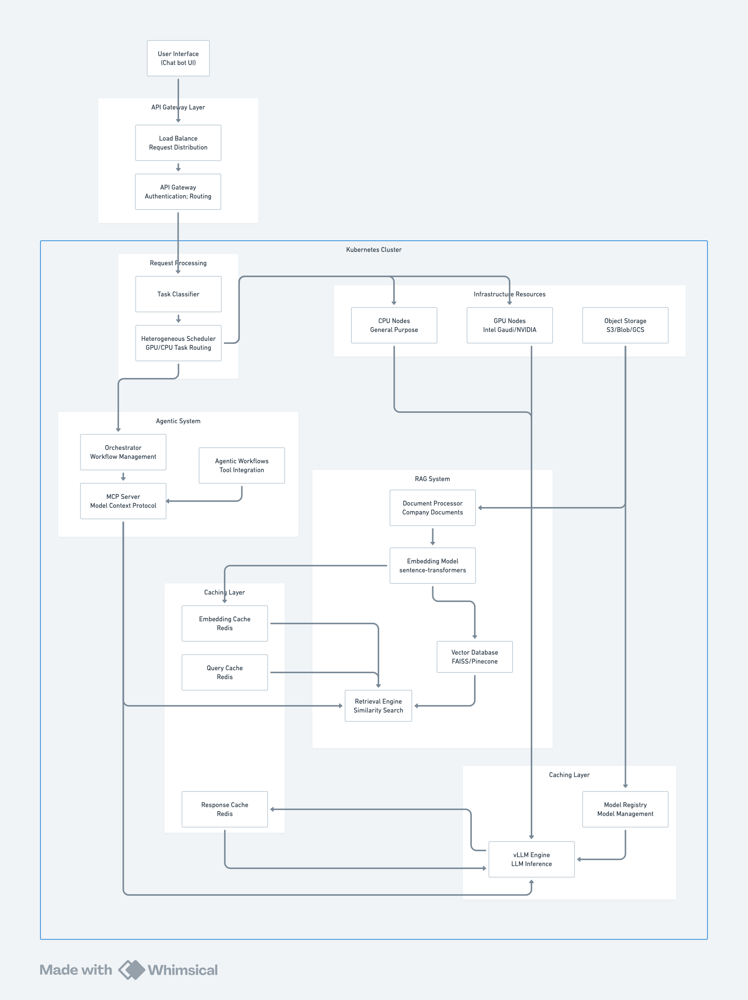

# Optimizing Cloud-Based Inference for RAG and Agentic Workloads

## Project Overview

This project focuses on optimizing cloud-based inference for RAG (Retrieval-Augmented Generation) and agentic workloads. We will explore how modern AI inference workloads can be efficiently served using cloud-native infrastructure, evaluating different components including model serving frameworks, orchestration layers, caching strategies, and GPU/accelerator utilization. The key objective is to identify performance and cost trade-offs when deploying these systems on major cloud platforms.

## 1. Vision and Goals Of The Project:

**Vision**: To deliver a comprehensive benchmarking framework that enables organizations to make informed decisions about deploying scalable, high-performance AI inference systems in cloud environments, with particular focus on RAG and agentic workloads.

**Goals**:
- Understand AI inference architectures and how modern LLM workloads (e.g., RAG, agentic tasks) are structured and executed in cloud environments
- Deploy and manage inference stacks using tools such as vLLM and llm-d, and integrate them with open-source language models
- Configure and benchmark accelerator-based infrastructure (e.g., Intel Gaudi, NVIDIA GPUs) for high-performance model serving
- Design and run benchmarking experiments to evaluate inference performance in terms of latency, throughput, scalability, and cost

## 2. Users/Personas Of The Project:

**Primary Users**:
- ML Engineers who need to deploy and optimize LLM inference systems in production environments
- Cloud Architects responsible for designing scalable cloud infrastructure for AI workloads
- DevOps Engineers who manage and maintain AI inference systems in cloud environments

**Secondary Users**:
- Research Teams conducting experiments on LLM performance and efficiency
- Product Managers making decisions about AI infrastructure investments

## 3. Scope and Features Of The Project:

**In Scope**:
- Core inference engine using vLLM with orchestration via llm-d
- RAG system implementation with document processing, embedding generation, and vector search
- Caching layer using Redis for embeddings, queries, and responses
- Standardized benchmarking suite with performance measurement tools (Locust/JMeter, Prometheus)
- Multi-cloud support for AWS, Azure, and Intel Gaudi accelerator testing
- Performance metrics including throughput, latency, resource utilization, and cost efficiency analysis

**Out of Scope**:
- Custom model training or fine-tuning
- Real-time production deployment beyond testing environments
- Integration with proprietary cloud services not available for testing
- Long-term production monitoring and maintenance

## 4. Solution Concept

### Global Architectural Structure Of the Project:
This project mainly includes two parts: serving and benchmarking.

For serving, this project adopts Kubernetes to manage and organize computing and storage resources, where vLLM, as the core of high-performance LLM inference that empowers various upper-level applications, such as text generation and workflows, can be deployed on different nodes along with facilities for agentic workflow, like Cloud-native vector database. Additionally, common mechanisms like load balance, fault tolerance, and dynamic scaling can be supported if resources allow.
As for the benchmarking, this project includes a benchmark suite that can test different metrics (e.g., Throughput, TTFT, and TPOT) under different scenarios with adjustable payloads.

The architecture follows a phased approach with four distinct phases:

**Phase 1: vLLM** - Basic vLLM setup for LLM inference

**Phase 2: RAG System (+ Vector DB)** - Integration of Retrieval Augmented Generation system with Vector Database

**Phase 3: Caching (+ Redis Cache)** - Incorporation of caching using Redis

**Phase 4: Agentic (+ Orchestration + MCP Server + Heterogeneous Scheduling)** - Addition of agentic capabilities with MCP server and intelligent GPU/CPU task routing

The system includes request processing layer (Load Balancer, API Gateway, Task Classifier, Heterogeneous Scheduler), core inference engine (vLLM Engine, Model Registry), RAG system (Document Processor, Embedding Model, Vector Database, Retrieval Engine), agentic system (MCP Server, Orchestrator, Agentic Workflows), caching layer (Embedding Cache, Query Cache, Response Cache), and infrastructure resources (GPU Nodes, CPU Nodes, Object Storage).

### Design Implications and Discussion:

To accommodate cloud computing, all components in the serving part can be distributed. With proper configurations, the system could have high availability and be robust to the single point of failure (SPOF). At the same time, it also allows the dynamic scaling just in case the computing resource runs out.

## 5. Acceptance criteria

**Minimum Acceptance Criteria**:
- Successfully deploy vLLM engine on at least two cloud platforms
- Implement complete RAG pipeline with vector database integration
- Deploy Redis caching layer with measurable performance improvements
- Create standardized benchmarking suite with automated metrics collection
- Generate comparative analysis report covering performance and cost metrics
- Document best practices for cloud-based AI inference deployment

**Stretch Goals**:
- Support for agentic workflows with tool integration
- Real-time cost optimization recommendations
- Automated scaling policies based on workload patterns

## 6. Release Planning:

**Sprint 1 (09/24)**
- Set up development environment and cloud access
- Deploy basic vLLM infrastructure
- Implement initial benchmarking suite
- Establish baseline performance metrics

**Sprint 2 (10/08)**
- Integrate document processing pipeline
- Deploy vector database and embedding model
- Implement retrieval engine
- Measure RAG-specific performance metrics

**Sprint 3 (10/29)**
- Deploy Redis caching infrastructure
- Implement all three cache types (embedding, query, response)
- Optimize cache configurations
- Measure cache performance impact

**Sprint 4 (11/05)**
- Add orchestration layer for complex workflows
- Implement agentic task management
- Performance testing and optimization

**Sprint 5 (11/19)**
- Final performance testing and optimization
- Generate comprehensive analysis report
- Prepare final presentation materials

**Final Presentation (12/08)**
- Present project results and findings
- Demonstrate benchmarking framework
- Share best practices and recommendations

## General comments

Remember that you can always add features at the end of the semester, but you can't go back in time and gain back time you spent on features that you couldn't complete.

For more help on markdown, see
https://github.com/adam-p/markdown-here/wiki/Markdown-Cheatsheet

In particular, you can add images like this (clone the repository to see details):

