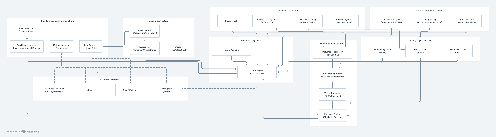

# Optimizing Cloud-Based Inference for RAG and Agentic Workloads

## Project Overview

This project focuses on optimizing cloud-based inference for RAG (Retrieval-Augmented Generation) and agentic workloads. We will explore how modern AI inference workloads can be efficiently served using cloud-native infrastructure, evaluating different components including model serving frameworks, orchestration layers, caching strategies, and GPU/accelerator utilization. The key objective is to identify performance and cost trade-offs when deploying these systems on major cloud platforms.

## 1. Vision and Goals Of The Project:

Our vision is to design and optimize a scalable cloud-based inference stack that enables efficient deployment of modern large language model (LLM) workloads, including Retrieval-Augmented Generation (RAG) and agentic applications. The project will demonstrate how end-to-end inference workflows can be deployed on heterogeneous cloud infrastructure, leveraging CPUs and accelerators (e.g., GPUs or Intel Gaudi), and orchestrated through Kubernetes. By doing so, we aim to establish best practices that balance performance, cost, and scalability when deploying AI systems in real-world cloud environments. The culmination of this work will be a comprehensive benchmarking report that documents our findings, performance trade-offs, and recommended practices for future deployments.

**High-Level Goals**:
- End-to-End Inference Flow: Build and deploy a complete inference pipeline that supports both simple chatbot interactions and more advanced agentic use cases (e.g., automating domain-specific tasks).
- Retrieval-Augmented Generation (RAG): Implement RAG pipelines that enhance inference by incorporating external, domain-specific data at query time, improving relevance and adaptability of outputs.
- Inference Stack Optimization: Evaluate model serving frameworks such as vLLM and orchestration tools like llm-d, focusing on latency, throughput, and cost trade-offs.
- Deployment on Cloud Infrastructure: Containerize and manage the inference stack within a Kubernetes cluster, enabling reproducible, scalable deployments.
- Benchmarking and Best Practices: Develop a standardized benchmarking suite to compare configurations, analyze results, and compile findings into a final report.

Stretch Goals: 
- Heterogeneous Scheduling: Explore strategies for efficiently distributing workloads across CPUs and accelerators, identifying where GPU offloading provides the most performance benefit.

## 2. Users/Personas Of The Project:
This project is designed for technical professionals who deploy, optimize, and maintain AI inference systems, as well as stakeholders who depend on benchmarking insights to guide research or business decisions.

**Primary Users**:
- ML Engineers: Deploy and optimize LLM inference systems in production environments. They require tools to evaluate latency, throughput, and efficiency across different configurations.
- Cloud Architects: Design and manage scalable cloud infrastructure. They are focused on heterogeneous scheduling, balancing workloads between CPUs and accelerators, and optimizing cost-performance trade-offs.
- DevOps Engineers: Maintain the reliability, scalability, and observability of deployed inference systems. They require containerized deployments, CI/CD integration, and monitoring for system health.

**Secondary Users**:
- Research Teams: Conduct experiments to measure LLM performance, reproducibility, and efficiency across hardware and inference stacks. Their focus is on generating insights rather than maintaining production deployments.
- Product Managers: Use benchmarking results to make infrastructure investment decisions. They are interested in high-level cost, performance, and scalability trade-offs rather than implementation details.

## 3. Scope and Features Of The Project:

**In Scope**:
- **Support various LLM inference tasks** (e.g., text generation and question answering).
- **Organize modern LLM workloads** (Agentic tasks, RAG workflows) and experiment with different configurations
  -  Core inference engine built with vLLM
  - Tweak inference parameters in prebuilt models to improve performance
  - Execute in cloud native environments
 - **Craft a benchmarking suite** that can measure the key performance of our system
    - Report metrics (throughput, latency, cost-efficiency, resource utilization, etc.)
    - Evaluate different components of the inference stack (orchestration layers, caching strategies, and GPU/accelerator utilization, etc.)
- **Compare the performance of different inference stack configurations** and highlight best practices for scalability and deployment

**Out of scope**:
- Configure and execute LLM-based inference stacks in non-cloud environments
- Training and fine-tuning LLMs (existing models will be used instead) 
- Long-term production deployment and monitoring

## 4. Solution Concept

### Global Architectural Structure Of the Project:

The architecture follows a phased approach with four distinct phases:

**Phase 1: vLLM** - Basic vLLM setup for LLM inference
**Phase 2: RAG System (+ Vector DB)** - Integration of Retrieval Augmented Generation system with Vector Database
**Phase 3: Caching (+ Redis Cache)** - Incorporation of caching using Redis
**Phase 4: Agentic (+ Orchestration)** - Addition of agentic capabilities and orchestration

The system includes standardized benchmarking suite components (Load Generator, Workload Definition, Metrics Collector, Cost Analyzer), cloud infrastructure (Kubernetes, Storage, Model Registry), RAG components (Document Processor, Embedding Model, Vector Database, Retrieval Engine), and caching layer (Embedding Cache, Query Cache, Response Cache).

### Design Implications and Discussion:

The phased approach allows for incremental complexity and performance measurement at each stage. The modular design enables independent testing of components while maintaining system integration. The standardized benchmarking suite ensures consistent and comparable results across different configurations and cloud platforms.

## 5. Acceptance criteria

**Minimum Acceptance Criteria**:
- Successfully deploy vLLM engine on at least two cloud platforms
- Implement complete RAG pipeline with vector database integration
- Deploy Redis caching layer with measurable performance improvements
- Create standardized benchmarking suite with automated metrics collection
- Generate comparative analysis report covering performance and cost metrics
- Document best practices for cloud-based AI inference deployment

**Stretch Goals**:
- Support for agentic workflows with tool integration
- Real-time cost optimization recommendations
- Automated scaling policies based on workload patterns

## 6. Release Planning:

**Sprint 1 (09/24)**
- Set up development environment and cloud access
- Deploy basic vLLM infrastructure
- Implement initial benchmarking suite
- Establish baseline performance metrics

**Sprint 2 (10/08)**
- Integrate document processing pipeline
- Deploy vector database and embedding model
- Implement retrieval engine
- Measure RAG-specific performance metrics

**Sprint 3 (10/29)**
- Deploy Redis caching infrastructure
- Implement all three cache types (embedding, query, response)
- Optimize cache configurations
- Measure cache performance impact

**Sprint 4 (11/05)**
- Add orchestration layer for complex workflows
- Implement agentic task management
- Performance testing and optimization

**Sprint 5 (11/19)**
- Final performance testing and optimization
- Generate comprehensive analysis report
- Prepare final presentation materials

**Final Presentation (12/08)**
- Present project results and findings
- Demonstrate benchmarking framework
- Share best practices and recommendations

## General comments

Remember that you can always add features at the end of the semester, but you can't go back in time and gain back time you spent on features that you couldn't complete.

For more help on markdown, see
https://github.com/adam-p/markdown-here/wiki/Markdown-Cheatsheet

In particular, you can add images like this (clone the repository to see details):

